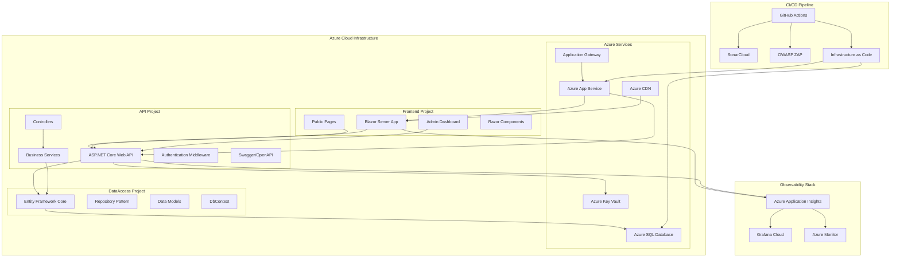
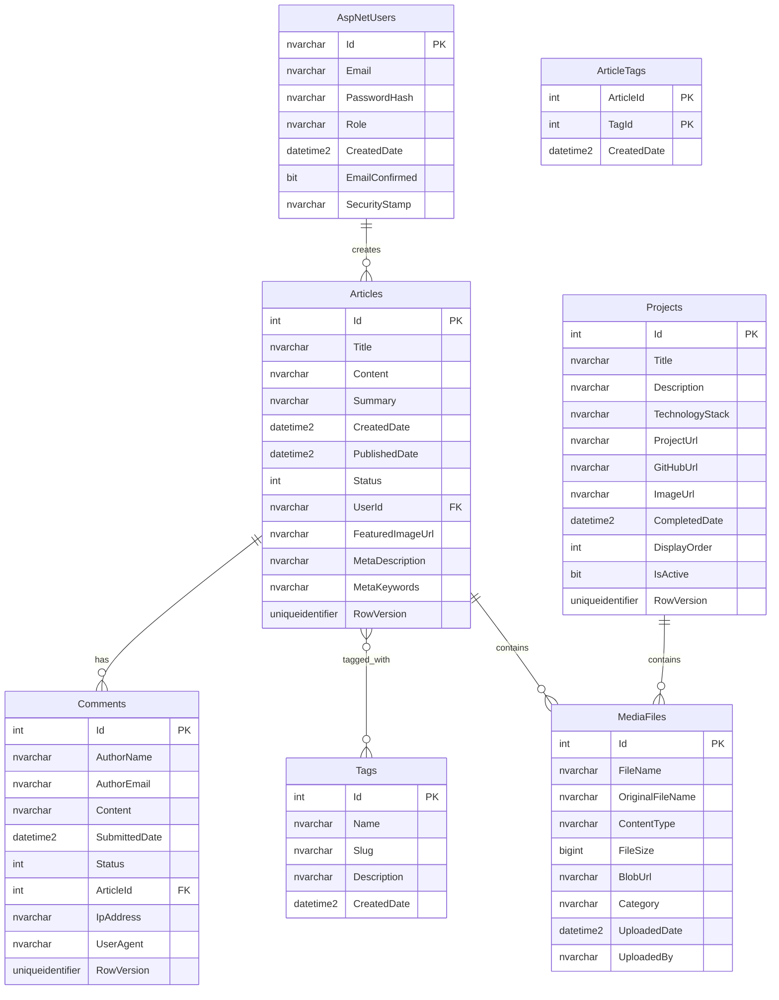

# Design Document

## Overview

The Personal Portfolio CMS is architected as a production-ready, cloud-native application with a three-project architecture deployed on Azure. The system consists of independent, deployable projects: Frontend (Blazor Server), API Backend (ASP.NET Core Web API), and Data Access Layer (Entity Framework Core). The architecture emphasizes clean separation of concerns, comprehensive observability, security-first design, and infrastructure as code for reliable, scalable deployment.

## Architecture

### Three-Project Architecture



### Technology Stack

#### Frontend Project
- **Framework**: Blazor Server with Razor components
- **UI Components**: Bootstrap 5, custom CSS
- **Rich Text**: Blazored.TextEditor or TinyMCE
- **Authentication**: ASP.NET Core Identity integration

#### API Project
- **Framework**: ASP.NET Core 8.0 Web API
- **Authentication**: JWT tokens with ASP.NET Core Identity
- **Documentation**: Swagger/OpenAPI 3.0 with Swashbuckle
- **Validation**: FluentValidation
- **Caching**: In-memory caching with IMemoryCache

#### DataAccess Project
- **ORM**: Entity Framework Core 8.0
- **Database**: Azure SQL Database Free tier (32 MB storage)
- **Patterns**: Repository and Unit of Work patterns
- **Migrations**: EF Core Code-First migrations

#### Azure Infrastructure
- **Hosting**: Azure App Service (Linux containers)
- **Database**: Azure SQL Database Free tier (32 MB storage limit)
- **CDN**: Azure CDN for static assets
- **Security**: Azure Key Vault for secrets management (database passwords, connection strings, API keys)
- **Identity**: Managed Identity for secure Key Vault access without storing credentials
- **Load Balancing**: Azure Application Gateway
- **Storage**: Azure Blob Storage for media files

#### Observability & Monitoring
- **APM**: Azure Application Insights
- **Metrics**: Grafana Cloud (free tier)
- **Logging**: Azure Monitor Logs
- **Alerting**: Grafana Cloud alerts and Azure Monitor alerts

#### CI/CD & Security
- **Pipeline**: GitHub Actions
- **Static Analysis**: SonarCloud
- **Security Scanning**: OWASP ZAP
- **Infrastructure**: OpenTofu/Terraform
- **Container Registry**: Azure Container Registry

## Components and Interfaces

### Project Structure

```
PortfolioCMS.sln
├── src/
│   ├── PortfolioCMS.Frontend/          # Blazor Server Project
│   │   ├── Components/
│   │   ├── Pages/
│   │   ├── Services/
│   │   └── Program.cs
│   ├── PortfolioCMS.API/               # Web API Project
│   │   ├── Controllers/
│   │   ├── Services/
│   │   ├── DTOs/
│   │   ├── Middleware/
│   │   └── Program.cs
│   └── PortfolioCMS.DataAccess/        # Data Access Project
│       ├── Entities/
│       ├── Repositories/
│       ├── Context/
│       └── Migrations/
├── infrastructure/                      # OpenTofu/Terraform
│   ├── main.tf
│   ├── variables.tf
│   └── outputs.tf
├── .github/workflows/                   # CI/CD Pipeline
│   ├── ci.yml
│   ├── deploy-staging.yml
│   └── deploy-production.yml
└── tests/
    ├── PortfolioCMS.Frontend.Tests/
    ├── PortfolioCMS.API.Tests/
    └── PortfolioCMS.DataAccess.Tests/
```

### DataAccess Project - Core Entities

```csharp
// PortfolioCMS.DataAccess/Entities/Article.cs
namespace PortfolioCMS.DataAccess.Entities
{
    public class Article
    {
        public int Id { get; set; }
        public string Title { get; set; } = string.Empty;
        public string Content { get; set; } = string.Empty;
        public string Summary { get; set; } = string.Empty;
        public DateTime CreatedDate { get; set; }
        public DateTime? PublishedDate { get; set; }
        public ArticleStatus Status { get; set; }
        public string? FeaturedImageUrl { get; set; }
        public string? MetaDescription { get; set; }
        public string? MetaKeywords { get; set; }
        
        // Navigation Properties
        public virtual ICollection<Tag> Tags { get; set; } = new List<Tag>();
        public virtual ICollection<Comment> Comments { get; set; } = new List<Comment>();
        public virtual ICollection<ArticleTag> ArticleTags { get; set; } = new List<ArticleTag>();
    }

    public class Comment
    {
        public int Id { get; set; }
        public string AuthorName { get; set; } = string.Empty;
        public string AuthorEmail { get; set; } = string.Empty;
        public string Content { get; set; } = string.Empty;
        public DateTime SubmittedDate { get; set; }
        public CommentStatus Status { get; set; }
        public string? IpAddress { get; set; }
        public string? UserAgent { get; set; }
        
        // Foreign Keys
        public int ArticleId { get; set; }
        public virtual Article Article { get; set; } = null!;
    }

    public class Project
    {
        public int Id { get; set; }
        public string Title { get; set; } = string.Empty;
        public string Description { get; set; } = string.Empty;
        public string? TechnologyStack { get; set; }
        public string? ProjectUrl { get; set; }
        public string? GitHubUrl { get; set; }
        public string? ImageUrl { get; set; }
        public DateTime? CompletedDate { get; set; }
        public int DisplayOrder { get; set; }
        public bool IsActive { get; set; } = true;
    }
}
```

### DataAccess Project - Repository Interfaces

```csharp
// PortfolioCMS.DataAccess/Repositories/IRepository.cs
namespace PortfolioCMS.DataAccess.Repositories
{
    public interface IRepository<T> where T : class
    {
        Task<T?> GetByIdAsync(int id);
        Task<IEnumerable<T>> GetAllAsync();
        Task<T> AddAsync(T entity);
        Task UpdateAsync(T entity);
        Task DeleteAsync(int id);
        Task<bool> ExistsAsync(int id);
    }

    public interface IArticleRepository : IRepository<Article>
    {
        Task<IEnumerable<Article>> GetPublishedArticlesAsync();
        Task<IEnumerable<Article>> SearchArticlesAsync(string query);
        Task<Article?> GetByIdWithCommentsAsync(int id);
        Task<IEnumerable<Article>> GetByTagAsync(string tagName);
    }

    public interface IUnitOfWork : IDisposable
    {
        IArticleRepository Articles { get; }
        ICommentRepository Comments { get; }
        IProjectRepository Projects { get; }
        ITagRepository Tags { get; }
        Task<int> SaveChangesAsync();
        Task BeginTransactionAsync();
        Task CommitTransactionAsync();
        Task RollbackTransactionAsync();
    }
}
```

### API Project - Service Interfaces

```csharp
// PortfolioCMS.API/Services/IContentService.cs
namespace PortfolioCMS.API.Services
{
    public interface IContentService
    {
        Task<IEnumerable<ArticleDto>> GetPublishedArticlesAsync();
        Task<ArticleDetailDto?> GetArticleByIdAsync(int id);
        Task<ArticleDto> CreateArticleAsync(CreateArticleDto dto);
        Task<ArticleDto> UpdateArticleAsync(int id, UpdateArticleDto dto);
        Task DeleteArticleAsync(int id);
        Task<IEnumerable<ArticleDto>> SearchArticlesAsync(string query);
    }

    public interface ICommentService
    {
        Task<CommentDto> SubmitCommentAsync(CreateCommentDto dto);
        Task<IEnumerable<CommentDto>> GetPendingCommentsAsync();
        Task ApproveCommentAsync(int commentId);
        Task RejectCommentAsync(int commentId);
        Task DeleteCommentAsync(int commentId);
    }

    public interface IMediaService
    {
        Task<string> UploadImageAsync(IFormFile file, string category);
        Task<IEnumerable<MediaFileDto>> GetMediaFilesAsync();
        Task DeleteMediaFileAsync(string fileName);
        Task<bool> ValidateImageAsync(IFormFile file);
    }

    public interface IObservabilityService
    {
        void TrackEvent(string eventName, Dictionary<string, string>? properties = null);
        void TrackException(Exception exception, Dictionary<string, string>? properties = null);
        void TrackMetric(string metricName, double value, Dictionary<string, string>? properties = null);
        void TrackDependency(string dependencyName, string commandName, DateTime startTime, TimeSpan duration, bool success);
    }
}
```

### API Project - Controllers Structure

```csharp
// PortfolioCMS.API/Controllers/ArticlesController.cs
[ApiController]
[Route("api/v1/[controller]")]
[Produces("application/json")]
public class ArticlesController : ControllerBase
{
    /// <summary>
    /// Get all published articles with pagination
    /// </summary>
    [HttpGet]
    [ProducesResponseType(typeof(PagedResult<ArticleDto>), 200)]
    public async Task<ActionResult<PagedResult<ArticleDto>>> GetArticles([FromQuery] ArticleQueryParameters parameters);

    /// <summary>
    /// Get article by ID with comments
    /// </summary>
    [HttpGet("{id:int}")]
    [ProducesResponseType(typeof(ArticleDetailDto), 200)]
    [ProducesResponseType(404)]
    public async Task<ActionResult<ArticleDetailDto>> GetArticle(int id);

    /// <summary>
    /// Search articles by query
    /// </summary>
    [HttpGet("search")]
    [ProducesResponseType(typeof(IEnumerable<ArticleDto>), 200)]
    public async Task<ActionResult<IEnumerable<ArticleDto>>> SearchArticles([FromQuery] string query);

    /// <summary>
    /// Create new article (Admin only)
    /// </summary>
    [HttpPost]
    [Authorize(Roles = "Admin")]
    [ProducesResponseType(typeof(ArticleDto), 201)]
    [ProducesResponseType(400)]
    [ProducesResponseType(401)]
    public async Task<ActionResult<ArticleDto>> CreateArticle([FromBody] CreateArticleDto dto);
}

// PortfolioCMS.API/Controllers/HealthController.cs
[ApiController]
[Route("api/v1/[controller]")]
public class HealthController : ControllerBase
{
    /// <summary>
    /// Health check endpoint for monitoring
    /// </summary>
    [HttpGet]
    [ProducesResponseType(typeof(HealthCheckResult), 200)]
    public async Task<ActionResult<HealthCheckResult>> GetHealth();

    /// <summary>
    /// Readiness check for Kubernetes/container orchestration
    /// </summary>
    [HttpGet("ready")]
    [ProducesResponseType(200)]
    [ProducesResponseType(503)]
    public async Task<ActionResult> GetReadiness();
}
```

## Data Models

### Azure SQL Database Schema



### Entity Relationships and Constraints

- **One-to-Many**: AspNetUsers → Articles, Articles → Comments
- **Many-to-Many**: Articles ↔ Tags (via ArticleTags junction table)
- **One-to-Many**: Articles → MediaFiles, Projects → MediaFiles
- **Indexes**: Clustered indexes on primary keys, non-clustered indexes on foreign keys and frequently queried columns
- **Constraints**: Foreign key constraints with cascade delete where appropriate, check constraints for status enums
- **Audit Fields**: RowVersion for optimistic concurrency control, CreatedDate/ModifiedDate for audit trails

## Error Handling

### Global Exception Handling with Observability

```csharp
// PortfolioCMS.API/Middleware/GlobalExceptionMiddleware.cs
public class GlobalExceptionMiddleware
{
    private readonly RequestDelegate _next;
    private readonly ILogger<GlobalExceptionMiddleware> _logger;
    private readonly IObservabilityService _observability;

    public async Task InvokeAsync(HttpContext context, RequestDelegate next)
    {
        try
        {
            await next(context);
        }
        catch (ValidationException ex)
        {
            _observability.TrackException(ex, new Dictionary<string, string>
            {
                ["ErrorType"] = "Validation",
                ["RequestPath"] = context.Request.Path
            });
            await HandleValidationExceptionAsync(context, ex);
        }
        catch (UnauthorizedAccessException ex)
        {
            _observability.TrackException(ex, new Dictionary<string, string>
            {
                ["ErrorType"] = "Authorization",
                ["RequestPath"] = context.Request.Path
            });
            await HandleUnauthorizedExceptionAsync(context, ex);
        }
        catch (Exception ex)
        {
            _observability.TrackException(ex, new Dictionary<string, string>
            {
                ["ErrorType"] = "Unhandled",
                ["RequestPath"] = context.Request.Path
            });
            await HandleGenericExceptionAsync(context, ex);
        }
    }
}
```

### Standardized Error Response Format

```json
{
    "error": {
        "code": "VALIDATION_ERROR",
        "message": "One or more validation errors occurred",
        "details": [
            {
                "field": "Title",
                "message": "Title is required"
            }
        ],
        "timestamp": "2024-01-01T12:00:00Z",
        "traceId": "00-4bf92f3577b34da6a3ce929d0e0e4736-00f067aa0ba902b7-01",
        "instance": "/api/v1/articles"
    }
}
```

### Frontend Error Handling

```csharp
// PortfolioCMS.Frontend/Services/ApiService.cs
public class ApiService
{
    private readonly HttpClient _httpClient;
    private readonly IObservabilityService _observability;

    public async Task<T?> GetAsync<T>(string endpoint)
    {
        try
        {
            var response = await _httpClient.GetAsync(endpoint);
            if (response.IsSuccessStatusCode)
            {
                var content = await response.Content.ReadAsStringAsync();
                return JsonSerializer.Deserialize<T>(content);
            }
            
            _observability.TrackEvent("ApiCallFailed", new Dictionary<string, string>
            {
                ["Endpoint"] = endpoint,
                ["StatusCode"] = response.StatusCode.ToString()
            });
            
            return default(T);
        }
        catch (HttpRequestException ex)
        {
            _observability.TrackException(ex);
            throw new ServiceException("Network error occurred", ex);
        }
    }
}
```

## Testing Strategy

### Unit Testing (Per Project)

#### DataAccess Project Tests
- **Repository Tests**: Test CRUD operations with in-memory database
- **Entity Tests**: Test model validation and relationships
- **DbContext Tests**: Test configuration and migrations

#### API Project Tests
- **Controller Tests**: Test endpoints with mocked services
- **Service Tests**: Test business logic with mocked repositories
- **Middleware Tests**: Test exception handling and authentication
- **Validation Tests**: Test FluentValidation rules

#### Frontend Project Tests
- **Component Tests**: Test Blazor components with bUnit
- **Service Tests**: Test API integration services
- **Page Tests**: Test page routing and authentication

### Integration Testing

- **API Integration**: Test complete request/response cycles with TestServer
- **Database Integration**: Test EF Core with Azure SQL Database LocalDB
- **Authentication**: Test JWT token generation and validation
- **Cross-Project Integration**: Test Frontend → API → DataAccess flow

### End-to-End Testing

- **User Journey Tests**: Complete workflows from UI to database
- **Browser Tests**: Cross-browser compatibility with Playwright
- **Performance Tests**: Load testing with NBomber
- **Security Tests**: Automated security scanning in CI/CD

### Testing Tools and Frameworks

- **Unit Tests**: xUnit, Moq, FluentAssertions, AutoFixture
- **Integration Tests**: ASP.NET Core Test Host, TestContainers for Azure SQL
- **Component Tests**: bUnit for Blazor components
- **E2E Tests**: Playwright for browser automation
- **Performance Tests**: NBomber, Azure Load Testing
- **Security Tests**: OWASP ZAP, SonarCloud security rules

### CI/CD Testing Pipeline

```yaml
# .github/workflows/ci.yml
name: CI Pipeline
on: [push, pull_request]

jobs:
  test:
    runs-on: ubuntu-latest
    steps:
      - name: Run Unit Tests
        run: dotnet test --configuration Release --logger trx --collect:"XPlat Code Coverage"
      
      - name: Run Integration Tests
        run: dotnet test tests/Integration --configuration Release
      
      - name: SonarCloud Analysis
        uses: SonarSource/sonarcloud-github-action@master
        env:
          GITHUB_TOKEN: ${{ secrets.GITHUB_TOKEN }}
          SONAR_TOKEN: ${{ secrets.SONAR_TOKEN }}
      
      - name: OWASP ZAP Security Scan
        uses: zaproxy/action-full-scan@v0.4.0
        with:
          target: 'https://staging.portfolio.com'
```

## Security Design

### Multi-Layer Security Architecture

#### Azure Security Services
- **Azure Key Vault**: Secrets, certificates, and encryption keys management
  - Database administrator password stored as secret
  - SQL connection strings stored as secrets
  - Storage account connection strings stored as secrets
  - Application secrets and API keys stored as secrets
- **Managed Identity**: System-assigned managed identity for App Services to access Key Vault
- **Azure Application Gateway**: WAF protection and SSL termination
- **Azure Active Directory**: Identity and access management integration
- **Azure Security Center**: Continuous security monitoring

#### Key Vault Integration Pattern
```csharp
// PortfolioCMS.API/Program.cs
var builder = WebApplication.CreateBuilder(args);

// Configure Key Vault integration using Managed Identity
if (!builder.Environment.IsDevelopment())
{
    var keyVaultUri = builder.Configuration["KeyVault:VaultUri"];
    builder.Configuration.AddAzureKeyVault(
        new Uri(keyVaultUri),
        new DefaultAzureCredential());
}

// Connection string retrieved from Key Vault at runtime
var connectionString = builder.Configuration["SqlConnectionString"];
builder.Services.AddDbContext<ApplicationDbContext>(options =>
    options.UseSqlServer(connectionString));
```

#### Application Security
- **Authentication**: ASP.NET Core Identity with JWT tokens
- **Authorization**: Role-based access control with custom policies
- **Input Validation**: FluentValidation with custom security rules
- **Output Encoding**: Automatic XSS protection in Blazor components

#### Security Headers and Policies
```csharp
// PortfolioCMS.API/Program.cs
app.UseSecurityHeaders(options =>
{
    options.AddContentSecurityPolicy(builder =>
    {
        builder.AddDefaultSrc().Self()
               .AddScriptSrc().Self().UnsafeInline()
               .AddStyleSrc().Self().UnsafeInline()
               .AddImgSrc().Self().Data().Https();
    });
    options.AddFrameOptions(XFrameOptionsPolicy.Deny);
    options.AddContentTypeOptions();
    options.AddReferrerPolicy(ReferrerPolicy.StrictOriginWhenCrossOrigin);
});
```

#### Security Scanning Integration
- **SonarCloud**: Static code analysis for security vulnerabilities
- **OWASP ZAP**: Dynamic application security testing
- **Snyk**: Dependency vulnerability scanning
- **Azure Defender**: Runtime threat protection

## Performance and Scalability Design

### Caching Strategy
```csharp
// Multi-tier caching approach
public class CachingService
{
    private readonly IMemoryCache _memoryCache;
    private readonly IDistributedCache _distributedCache;
    
    // L1: In-memory cache (fastest, per-instance)
    // L2: Azure Redis Cache (shared across instances)
    // L3: Azure CDN (global edge caching)
}
```

### Database Performance
- **Connection Pooling**: Optimized for Azure SQL Database
- **Query Optimization**: Proper indexing strategy and query hints
- **Read Replicas**: Azure SQL Database read-scale out for reporting
- **Partitioning**: Table partitioning for large datasets

### Azure Infrastructure Optimization
- **Auto-scaling**: Azure App Service automatic scaling rules
- **CDN Integration**: Azure CDN for static assets and media files
- **Application Insights**: Performance monitoring and optimization insights
- **Azure Front Door**: Global load balancing and performance acceleration

## Observability and Monitoring Design

### Comprehensive Monitoring Stack
```csharp
// PortfolioCMS.API/Services/ObservabilityService.cs
public class ObservabilityService : IObservabilityService
{
    private readonly TelemetryClient _telemetryClient;
    private readonly ILogger<ObservabilityService> _logger;
    
    public void TrackCustomMetric(string metricName, double value, Dictionary<string, string> properties)
    {
        // Send to both Application Insights and Grafana Cloud
        _telemetryClient.TrackMetric(metricName, value, properties);
        // Custom Grafana Cloud integration
    }
}
```

### Monitoring Dashboards
- **Grafana Cloud**: Custom dashboards for business metrics
- **Azure Monitor**: Infrastructure and application performance
- **Application Insights**: Detailed application telemetry
- **Azure Service Health**: Service availability and incidents

### Alerting Strategy
- **Critical Alerts**: Database connectivity, authentication failures
- **Performance Alerts**: Response time degradation, high error rates
- **Business Alerts**: Comment spam detection, unusual traffic patterns
- **Security Alerts**: Failed authentication attempts, suspicious activities

## Infrastructure as Code Design

### OpenTofu/Terraform Structure
```hcl
# infrastructure/main.tf
module "app_service" {
  source = "./modules/app-service"
  
  resource_group_name = var.resource_group_name
  app_service_plan_id = module.app_service_plan.id
  
  # Enable system-assigned managed identity
  identity {
    type = "SystemAssigned"
  }
  
  app_settings = {
    "ApplicationInsights__ConnectionString" = module.application_insights.connection_string
    "KeyVault__VaultUri" = module.key_vault.vault_uri
  }
}

module "sql_database" {
  source = "./modules/sql-database"
  
  resource_group_name = var.resource_group_name
  sql_server_name     = var.sql_server_name
  database_name       = var.database_name
  
  # Use Free tier for cost optimization
  sku_name = "Free"
  max_size_gb = 0.032  # 32 MB limit for Free tier
  
  backup_retention_days = 7  # Free tier supports 7 days
}

module "key_vault" {
  source = "./modules/key-vault"
  
  resource_group_name = var.resource_group_name
  key_vault_name      = var.key_vault_name
  
  # Grant App Service managed identity access to Key Vault
  access_policies = [
    {
      object_id = module.app_service.identity_principal_id
      secret_permissions = ["Get", "List"]
    }
  ]
}

# Store database password in Key Vault (manual setup required)
# Note: Initial password must be set via Azure CLI before first deployment
resource "azurerm_key_vault_secret" "sql_admin_password" {
  name         = "SqlAdminPassword"
  value        = var.sql_admin_password  # Retrieved from Key Vault or environment
  key_vault_id = module.key_vault.id
}
```

### Environment Management
- **Development**: Single-region deployment with Azure SQL Database Free tier
- **Staging**: Production-like environment with Basic SQL tier for testing
- **Production**: Multi-region deployment with Standard SQL tier and full observability stack

### Manual Setup Requirements
Some security-critical operations must be performed manually via Azure CLI:
1. Initial Key Vault secret creation for database password
2. Managed identity access policy configuration
3. Service principal setup for CI/CD pipelines