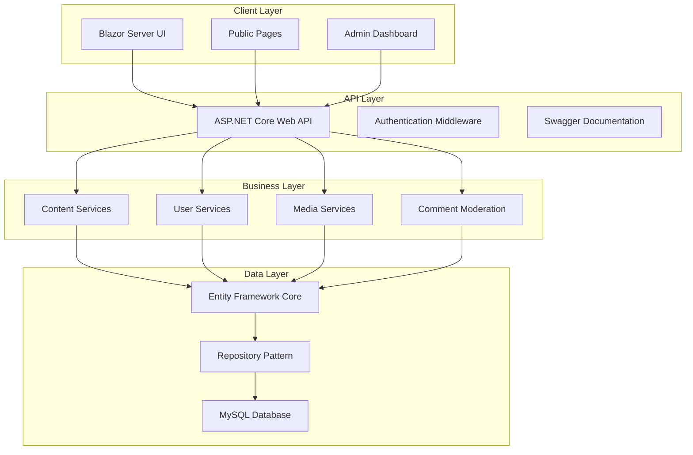
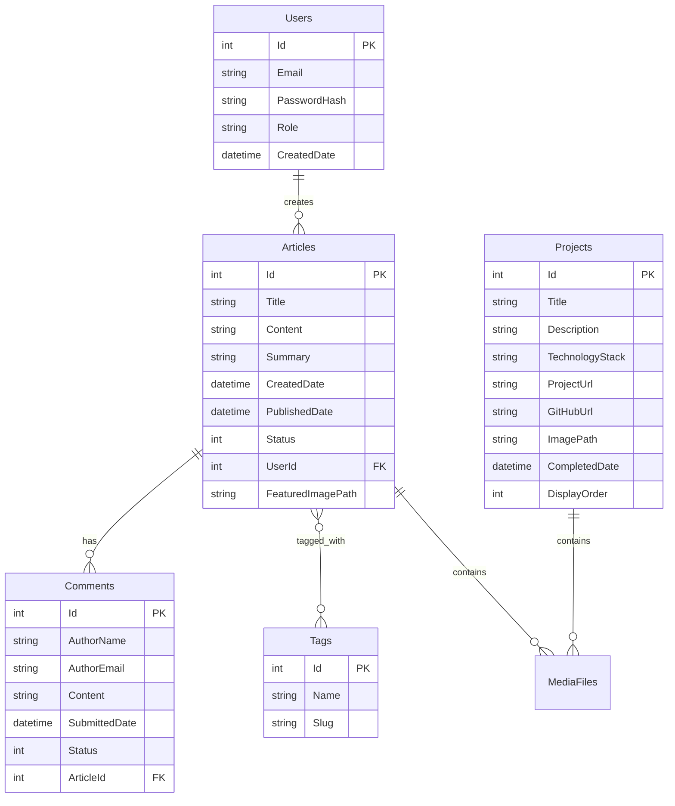

# Design Document

## Overview

The Personal Portfolio CMS is architected as a modern full-stack web application using Blazor Server for the UI layer, ASP.NET Core Web API for backend services, Entity Framework Core for data access, and MySQL for persistence. The system follows a clean architecture pattern with clear separation of concerns between presentation, business logic, and data layers.

## Architecture

### High-Level Architecture



### Technology Stack

- **Frontend**: Blazor Server with Razor components
- **Backend**: ASP.NET Core 8.0 Web API
- **Database**: MySQL 8.0+ with Entity Framework Core
- **Authentication**: ASP.NET Core Identity
- **Documentation**: Swagger/OpenAPI 3.0
- **File Storage**: Local file system with configurable path
- **Rich Text**: Blazor-compatible WYSIWYG editor (e.g., Blazored.TextEditor)

## Components and Interfaces

### Core Entities

```csharp
// Domain Models
public class Article
{
    public int Id { get; set; }
    public string Title { get; set; }
    public string Content { get; set; }
    public string Summary { get; set; }
    public DateTime CreatedDate { get; set; }
    public DateTime? PublishedDate { get; set; }
    public ArticleStatus Status { get; set; }
    public List<Tag> Tags { get; set; }
    public List<Comment> Comments { get; set; }
    public string? FeaturedImagePath { get; set; }
}

public class Comment
{
    public int Id { get; set; }
    public string AuthorName { get; set; }
    public string AuthorEmail { get; set; }
    public string Content { get; set; }
    public DateTime SubmittedDate { get; set; }
    public CommentStatus Status { get; set; }
    public int ArticleId { get; set; }
    public Article Article { get; set; }
}

public class Project
{
    public int Id { get; set; }
    public string Title { get; set; }
    public string Description { get; set; }
    public string? TechnologyStack { get; set; }
    public string? ProjectUrl { get; set; }
    public string? GitHubUrl { get; set; }
    public string? ImagePath { get; set; }
    public DateTime? CompletedDate { get; set; }
    public int DisplayOrder { get; set; }
}
```

### Service Interfaces

```csharp
public interface IContentService
{
    Task<IEnumerable<Article>> GetPublishedArticlesAsync();
    Task<Article> GetArticleByIdAsync(int id);
    Task<Article> CreateArticleAsync(CreateArticleDto dto);
    Task<Article> UpdateArticleAsync(int id, UpdateArticleDto dto);
    Task DeleteArticleAsync(int id);
    Task<IEnumerable<Article>> SearchArticlesAsync(string query);
}

public interface ICommentService
{
    Task<Comment> SubmitCommentAsync(CreateCommentDto dto);
    Task<IEnumerable<Comment>> GetPendingCommentsAsync();
    Task ApproveCommentAsync(int commentId);
    Task RejectCommentAsync(int commentId);
    Task DeleteCommentAsync(int commentId);
}

public interface IMediaService
{
    Task<string> UploadImageAsync(IFormFile file, string category);
    Task<IEnumerable<MediaFile>> GetMediaFilesAsync();
    Task DeleteMediaFileAsync(string filePath);
    Task<bool> ValidateImageAsync(IFormFile file);
}
```

### API Controllers Structure

```csharp
[ApiController]
[Route("api/[controller]")]
public class ArticlesController : ControllerBase
{
    // GET /api/articles - Public endpoint
    // GET /api/articles/{id} - Public endpoint
    // POST /api/articles - Admin only
    // PUT /api/articles/{id} - Admin only
    // DELETE /api/articles/{id} - Admin only
    // GET /api/articles/search?q={query} - Public endpoint
}

[ApiController]
[Route("api/[controller]")]
[Authorize(Roles = "Admin")]
public class AdminController : ControllerBase
{
    // Admin-specific endpoints for content management
    // Comment moderation endpoints
    // Media management endpoints
}
```

## Data Models

### Database Schema



### Entity Relationships

- **One-to-Many**: User → Articles, Article → Comments
- **Many-to-Many**: Articles ↔ Tags (via ArticleTags junction table)
- **One-to-Many**: Projects → MediaFiles, Articles → MediaFiles

## Error Handling

### Global Exception Handling

```csharp
public class GlobalExceptionMiddleware
{
    public async Task InvokeAsync(HttpContext context, RequestDelegate next)
    {
        try
        {
            await next(context);
        }
        catch (ValidationException ex)
        {
            await HandleValidationExceptionAsync(context, ex);
        }
        catch (UnauthorizedAccessException ex)
        {
            await HandleUnauthorizedExceptionAsync(context, ex);
        }
        catch (Exception ex)
        {
            await HandleGenericExceptionAsync(context, ex);
        }
    }
}
```

### Error Response Format

```json
{
    "error": {
        "code": "VALIDATION_ERROR",
        "message": "One or more validation errors occurred",
        "details": [
            {
                "field": "Title",
                "message": "Title is required"
            }
        ],
        "timestamp": "2024-01-01T12:00:00Z"
    }
}
```

### Client-Side Error Handling

- Blazor components will implement try-catch blocks for API calls
- User-friendly error messages displayed via toast notifications
- Fallback UI states for failed data loading
- Retry mechanisms for transient failures

## Testing Strategy

### Unit Testing

- **Service Layer**: Test business logic with mocked dependencies
- **Repository Layer**: Test data access with in-memory database
- **API Controllers**: Test endpoints with mocked services
- **Validation**: Test model validation and custom validators

### Integration Testing

- **API Integration**: Test complete request/response cycles
- **Database Integration**: Test EF Core migrations and queries
- **Authentication**: Test role-based access control

### End-to-End Testing

- **Public User Flows**: Article browsing, comment submission, contact form
- **Admin User Flows**: Content CRUD operations, comment moderation
- **Cross-browser Testing**: Ensure Blazor components work across browsers

### Testing Tools

- **Unit Tests**: xUnit, Moq, FluentAssertions
- **Integration Tests**: ASP.NET Core Test Host, TestContainers for MySQL
- **E2E Tests**: Playwright or Selenium for browser automation

## Security Considerations

### Authentication & Authorization

- ASP.NET Core Identity for user management
- JWT tokens for API authentication
- Role-based authorization (Admin, Viewer)
- Secure password hashing with bcrypt

### Input Validation & Sanitization

- Model validation attributes on DTOs
- HTML sanitization for rich text content
- File upload validation (type, size, content)
- SQL injection prevention via EF Core parameterized queries

### Security Headers

- HTTPS enforcement
- Content Security Policy (CSP)
- X-Frame-Options, X-Content-Type-Options
- CORS configuration for API endpoints

## Performance Considerations

### Caching Strategy

- In-memory caching for frequently accessed content
- Redis cache for distributed scenarios (future enhancement)
- Browser caching for static assets
- Database query optimization with proper indexing

### Database Optimization

- Indexes on frequently queried columns (Title, PublishedDate, Status)
- Pagination for article listings and comments
- Lazy loading for related entities where appropriate
- Connection pooling configuration

### File Storage

- Organized directory structure for uploaded media
- Image optimization and resizing
- CDN integration capability (future enhancement)
- File cleanup for deleted content