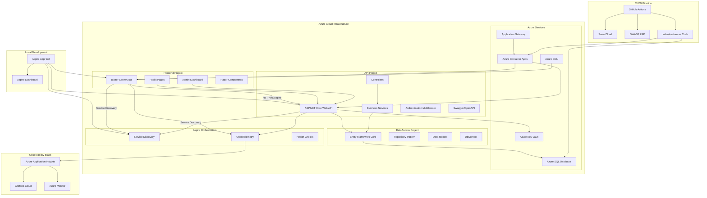

# Design Document

## Overview

The Personal Portfolio CMS is architected as a production-ready, cloud-native application orchestrated by .NET Aspire and deployed on Azure Container Apps. The system consists of independent, deployable projects: Frontend (Blazor Server), API Backend (ASP.NET Core Web API), and Data Access Layer (Entity Framework Core), all managed by an Aspire AppHost for service discovery, telemetry, and deployment. The architecture emphasizes clean separation of concerns, comprehensive observability through Aspire's built-in OpenTelemetry, security-first design, and infrastructure as code for reliable, scalable deployment.

## Architecture

### .NET Aspire Orchestrated Architecture



### Technology Stack

#### Platform Requirements
- **.NET Version**: .NET 10 (latest preview)
- **C# Version**: C# 14
- **.NET Aspire**: Latest stable version compatible with .NET 10

#### Frontend Project
- **Framework**: Blazor Server with Razor components (.NET 10)
- **Language**: C# 14
- **UI Components**: Bootstrap 5, custom CSS
- **Rich Text**: Blazored.TextEditor or TinyMCE
- **Authentication**: ASP.NET Core Identity integration

#### API Project
- **Framework**: ASP.NET Core 10.0 Web API
- **Language**: C# 14
- **Authentication**: JWT tokens with ASP.NET Core Identity
- **Documentation**: Swagger/OpenAPI 3.0 with Swashbuckle
- **Validation**: FluentValidation
- **Caching**: In-memory caching with IMemoryCache

#### DataAccess Project
- **ORM**: Entity Framework Core 10.0
- **Language**: C# 14
- **Database**: Azure SQL Database Free tier (32 MB storage)
- **Patterns**: Repository and Unit of Work patterns
- **Migrations**: EF Core Code-First migrations

#### .NET Aspire Orchestration
- **AppHost**: .NET Aspire orchestration project for service management
- **Service Discovery**: Built-in service discovery for Frontend-to-API communication
- **Telemetry**: OpenTelemetry integration for distributed tracing
- **Dashboard**: Aspire dashboard for local development and monitoring
- **Deployment**: Aspire manifest generation for Azure Container Apps

#### Azure Infrastructure
- **Hosting**: Azure Container Apps (managed by Aspire)
- **Database**: Azure SQL Database Free tier (32 MB storage limit)
- **CDN**: Azure CDN for static assets
- **Security**: Azure Key Vault for secrets management (database passwords, connection strings, API keys)
- **Identity**: Managed Identity for secure Key Vault access without storing credentials
- **Load Balancing**: Azure Application Gateway
- **Storage**: Azure Blob Storage for media files

#### Observability & Monitoring
- **APM**: Azure Application Insights
- **Metrics**: Grafana Cloud (free tier)
- **Logging**: Azure Monitor Logs
- **Alerting**: Grafana Cloud alerts and Azure Monitor alerts

#### CI/CD & Security
- **Pipeline**: GitHub Actions
- **Static Analysis**: SonarCloud
- **Security Scanning**: OWASP ZAP
- **Infrastructure**: OpenTofu/Terraform
- **Container Registry**: Azure Container Registry

## .NET Aspire Integration

### Aspire AppHost Configuration

```csharp
// PortfolioCMS.AppHost/Program.cs
var builder = DistributedApplication.CreateBuilder(args);

// Add Azure SQL Database resource
var sqlPassword = builder.AddParameter("sql-password", secret: true);
var sqlDatabase = builder.AddSqlServer("sql", sqlPassword)
    .WithDataVolume()
    .AddDatabase("portfoliodb");

// Add Azure Key Vault resource
var keyVault = builder.AddAzureKeyVault("keyvault");

// Add API project with service discovery
var apiService = builder.AddProject<Projects.PortfolioCMS_API>("api")
    .WithReference(sqlDatabase)
    .WithReference(keyVault)
    .WithEnvironment("ASPNETCORE_ENVIRONMENT", builder.Environment.EnvironmentName);

// Add Frontend project with service discovery to API
var frontend = builder.AddProject<Projects.PortfolioCMS_Frontend>("frontend")
    .WithReference(apiService)  // Enables service discovery
    .WithExternalHttpEndpoints();

builder.Build().Run();
```

### Service Defaults Configuration

```csharp
// PortfolioCMS.ServiceDefaults/Extensions.cs
public static class Extensions
{
    public static IHostApplicationBuilder AddServiceDefaults(this IHostApplicationBuilder builder)
    {
        // Add OpenTelemetry for distributed tracing
        builder.Services.AddOpenTelemetry()
            .WithMetrics(metrics =>
            {
                metrics.AddAspNetCoreInstrumentation()
                       .AddHttpClientInstrumentation()
                       .AddRuntimeInstrumentation();
            })
            .WithTracing(tracing =>
            {
                tracing.AddAspNetCoreInstrumentation()
                       .AddHttpClientInstrumentation()
                       .AddEntityFrameworkCoreInstrumentation();
            });

        // Add health checks
        builder.Services.AddHealthChecks()
            .AddCheck("self", () => HealthCheckResult.Healthy(), ["live"]);

        // Add service discovery
        builder.Services.AddServiceDiscovery();

        // Configure HttpClient defaults with resilience
        builder.Services.ConfigureHttpClientDefaults(http =>
        {
            http.AddStandardResilienceHandler();
            http.AddServiceDiscovery();
        });

        return builder;
    }
}
```

### Frontend Service Discovery Integration

```csharp
// PortfolioCMS.Frontend/Program.cs
var builder = WebApplication.CreateBuilder(args);

// Add Aspire service defaults
builder.AddServiceDefaults();

// Configure HttpClient with service discovery for API
builder.Services.AddHttpClient<IApiService, ApiService>(client =>
{
    // Aspire resolves "api" to the actual API service endpoint
    client.BaseAddress = new Uri("http://api");
})
.AddStandardResilienceHandler();

var app = builder.Build();

// Map Aspire health checks
app.MapDefaultEndpoints();

app.Run();
```

### API Service Discovery Integration

```csharp
// PortfolioCMS.API/Program.cs
var builder = WebApplication.CreateBuilder(args);

// Add Aspire service defaults
builder.AddServiceDefaults();

// Add SQL Server with connection string from Aspire
builder.AddSqlServerDbContext<ApplicationDbContext>("portfoliodb");

// Add Azure Key Vault from Aspire
builder.Configuration.AddAzureKeyVault(
    new Uri(builder.Configuration["KeyVault:VaultUri"]!),
    new DefaultAzureCredential());

var app = builder.Build();

// Map Aspire health checks and telemetry
app.MapDefaultEndpoints();

app.Run();
```

### Aspire Dashboard Benefits

- **Real-time Monitoring**: View logs, traces, and metrics in real-time during development
- **Service Discovery**: Visualize service-to-service communication
- **Distributed Tracing**: Track requests across Frontend → API → Database
- **Resource Management**: Monitor SQL Database, Key Vault, and other resources
- **Performance Insights**: Identify bottlenecks and optimize performance

### Deployment with Aspire

```bash
# Generate deployment manifest for Azure Container Apps
azd init

# Deploy to Azure using Aspire
azd up

# Aspire automatically:
# - Creates Azure Container Apps for Frontend and API
# - Configures service discovery between containers
# - Sets up Application Insights for telemetry
# - Configures managed identity for Key Vault access
# - Deploys with proper networking and scaling
```

## Components and Interfaces

### Project Structure with .NET Aspire

```
PortfolioCMS.sln
├── src/
│   ├── PortfolioCMS.AppHost/           # .NET Aspire Orchestration
│   │   ├── Program.cs                  # Aspire service configuration
│   │   └── appsettings.json
│   ├── PortfolioCMS.ServiceDefaults/   # Shared Aspire Configurations
│   │   ├── Extensions.cs               # Telemetry, health checks
│   │   └── appsettings.json
│   ├── PortfolioCMS.Frontend/          # Blazor Server Project
│   │   ├── Components/
│   │   ├── Pages/
│   │   ├── Services/
│   │   └── Program.cs                  # Uses ServiceDefaults
│   ├── PortfolioCMS.API/               # Web API Project
│   │   ├── Controllers/
│   │   ├── Services/
│   │   ├── DTOs/
│   │   ├── Middleware/
│   │   └── Program.cs                  # Uses ServiceDefaults
│   └── PortfolioCMS.DataAccess/        # Data Access Project
│       ├── Entities/
│       ├── Repositories/
│       ├── Context/
│       └── Migrations/
├── infrastructure/                      # OpenTofu/Terraform
│   ├── main.tf                         # Azure Container Apps
│   ├── variables.tf
│   └── outputs.tf
├── .github/workflows/                   # CI/CD Pipeline
│   ├── ci.yml
│   ├── deploy-staging.yml
│   └── deploy-production.yml
└── tests/
    ├── PortfolioCMS.UnitTests/
    ├── PortfolioCMS.IntegrationTests/
    └── PortfolioCMS.AppHost.Tests/     # Aspire orchestration tests
```

### DataAccess Project - Core Entities

```csharp
// PortfolioCMS.DataAccess/Entities/Article.cs
namespace PortfolioCMS.DataAccess.Entities
{
    public class Article
    {
        public int Id { get; set; }
        public string Title { get; set; } = string.Empty;
        public string Content { get; set; } = string.Empty;
        public string Summary { get; set; } = string.Empty;
        public DateTime CreatedDate { get; set; }
        public DateTime? PublishedDate { get; set; }
        public ArticleStatus Status { get; set; }
        public string? FeaturedImageUrl { get; set; }
        public string? MetaDescription { get; set; }
        public string? MetaKeywords { get; set; }
        
        // Navigation Properties
        public virtual ICollection<Tag> Tags { get; set; } = new List<Tag>();
        public virtual ICollection<Comment> Comments { get; set; } = new List<Comment>();
        public virtual ICollection<ArticleTag> ArticleTags { get; set; } = new List<ArticleTag>();
    }

    public class Comment
    {
        public int Id { get; set; }
        public string AuthorName { get; set; } = string.Empty;
        public string AuthorEmail { get; set; } = string.Empty;
        public string Content { get; set; } = string.Empty;
        public DateTime SubmittedDate { get; set; }
        public CommentStatus Status { get; set; }
        public string? IpAddress { get; set; }
        public string? UserAgent { get; set; }
        
        // Foreign Keys
        public int ArticleId { get; set; }
        public virtual Article Article { get; set; } = null!;
    }

    public class Project
    {
        public int Id { get; set; }
        public string Title { get; set; } = string.Empty;
        public string Description { get; set; } = string.Empty;
        public string? TechnologyStack { get; set; }
        public string? ProjectUrl { get; set; }
        public string? GitHubUrl { get; set; }
        public string? ImageUrl { get; set; }
        public DateTime? CompletedDate { get; set; }
        public int DisplayOrder { get; set; }
        public bool IsActive { get; set; } = true;
    }
}
```

### DataAccess Project - Repository Interfaces

```csharp
// PortfolioCMS.DataAccess/Repositories/IRepository.cs
namespace PortfolioCMS.DataAccess.Repositories
{
    public interface IRepository<T> where T : class
    {
        Task<T?> GetByIdAsync(int id);
        Task<IEnumerable<T>> GetAllAsync();
        Task<T> AddAsync(T entity);
        Task UpdateAsync(T entity);
        Task DeleteAsync(int id);
        Task<bool> ExistsAsync(int id);
    }

    public interface IArticleRepository : IRepository<Article>
    {
        Task<IEnumerable<Article>> GetPublishedArticlesAsync();
        Task<IEnumerable<Article>> SearchArticlesAsync(string query);
        Task<Article?> GetByIdWithCommentsAsync(int id);
        Task<IEnumerable<Article>> GetByTagAsync(string tagName);
    }

    public interface IUnitOfWork : IDisposable
    {
        IArticleRepository Articles { get; }
        ICommentRepository Comments { get; }
        IProjectRepository Projects { get; }
        ITagRepository Tags { get; }
        Task<int> SaveChangesAsync();
        Task BeginTransactionAsync();
        Task CommitTransactionAsync();
        Task RollbackTransactionAsync();
    }
}
```

### API Project - Service Interfaces

```csharp
// PortfolioCMS.API/Services/IContentService.cs
namespace PortfolioCMS.API.Services
{
    public interface IContentService
    {
        Task<IEnumerable<ArticleDto>> GetPublishedArticlesAsync();
        Task<ArticleDetailDto?> GetArticleByIdAsync(int id);
        Task<ArticleDto> CreateArticleAsync(CreateArticleDto dto);
        Task<ArticleDto> UpdateArticleAsync(int id, UpdateArticleDto dto);
        Task DeleteArticleAsync(int id);
        Task<IEnumerable<ArticleDto>> SearchArticlesAsync(string query);
    }

    public interface ICommentService
    {
        Task<CommentDto> SubmitCommentAsync(CreateCommentDto dto);
        Task<IEnumerable<CommentDto>> GetPendingCommentsAsync();
        Task ApproveCommentAsync(int commentId);
        Task RejectCommentAsync(int commentId);
        Task DeleteCommentAsync(int commentId);
    }

    public interface IMediaService
    {
        Task<string> UploadImageAsync(IFormFile file, string category);
        Task<IEnumerable<MediaFileDto>> GetMediaFilesAsync();
        Task DeleteMediaFileAsync(string fileName);
        Task<bool> ValidateImageAsync(IFormFile file);
    }

    public interface IObservabilityService
    {
        void TrackEvent(string eventName, Dictionary<string, string>? properties = null);
        void TrackException(Exception exception, Dictionary<string, string>? properties = null);
        void TrackMetric(string metricName, double value, Dictionary<string, string>? properties = null);
        void TrackDependency(string dependencyName, string commandName, DateTime startTime, TimeSpan duration, bool success);
    }
}
```

### API Project - Controllers Structure

```csharp
// PortfolioCMS.API/Controllers/ArticlesController.cs
[ApiController]
[Route("api/v1/[controller]")]
[Produces("application/json")]
public class ArticlesController : ControllerBase
{
    /// <summary>
    /// Get all published articles with pagination
    /// </summary>
    [HttpGet]
    [ProducesResponseType(typeof(PagedResult<ArticleDto>), 200)]
    public async Task<ActionResult<PagedResult<ArticleDto>>> GetArticles([FromQuery] ArticleQueryParameters parameters);

    /// <summary>
    /// Get article by ID with comments
    /// </summary>
    [HttpGet("{id:int}")]
    [ProducesResponseType(typeof(ArticleDetailDto), 200)]
    [ProducesResponseType(404)]
    public async Task<ActionResult<ArticleDetailDto>> GetArticle(int id);

    /// <summary>
    /// Search articles by query
    /// </summary>
    [HttpGet("search")]
    [ProducesResponseType(typeof(IEnumerable<ArticleDto>), 200)]
    public async Task<ActionResult<IEnumerable<ArticleDto>>> SearchArticles([FromQuery] string query);

    /// <summary>
    /// Create new article (Admin only)
    /// </summary>
    [HttpPost]
    [Authorize(Roles = "Admin")]
    [ProducesResponseType(typeof(ArticleDto), 201)]
    [ProducesResponseType(400)]
    [ProducesResponseType(401)]
    public async Task<ActionResult<ArticleDto>> CreateArticle([FromBody] CreateArticleDto dto);
}

// PortfolioCMS.API/Controllers/HealthController.cs
[ApiController]
[Route("api/v1/[controller]")]
public class HealthController : ControllerBase
{
    /// <summary>
    /// Health check endpoint for monitoring
    /// </summary>
    [HttpGet]
    [ProducesResponseType(typeof(HealthCheckResult), 200)]
    public async Task<ActionResult<HealthCheckResult>> GetHealth();

    /// <summary>
    /// Readiness check for Kubernetes/container orchestration
    /// </summary>
    [HttpGet("ready")]
    [ProducesResponseType(200)]
    [ProducesResponseType(503)]
    public async Task<ActionResult> GetReadiness();
}
```

## Data Models

### Azure SQL Database Schema


### Entity Relationships and Constraints

- **One-to-Many**: AspNetUsers → Articles, Articles → Comments
- **Many-to-Many**: Articles ↔ Tags (via ArticleTags junction table)
- **One-to-Many**: Articles → MediaFiles, Projects → MediaFiles
- **Indexes**: Clustered indexes on primary keys, non-clustered indexes on foreign keys and frequently queried columns
- **Constraints**: Foreign key constraints with cascade delete where appropriate, check constraints for status enums
- **Audit Fields**: RowVersion for optimistic concurrency control, CreatedDate/ModifiedDate for audit trails

## Error Handling

### Global Exception Handling with Observability

```csharp
// PortfolioCMS.API/Middleware/GlobalExceptionMiddleware.cs
public class GlobalExceptionMiddleware
{
    private readonly RequestDelegate _next;
    private readonly ILogger<GlobalExceptionMiddleware> _logger;
    private readonly IObservabilityService _observability;

    public async Task InvokeAsync(HttpContext context, RequestDelegate next)
    {
        try
        {
            await next(context);
        }
        catch (ValidationException ex)
        {
            _observability.TrackException(ex, new Dictionary<string, string>
            {
                ["ErrorType"] = "Validation",
                ["RequestPath"] = context.Request.Path
            });
            await HandleValidationExceptionAsync(context, ex);
        }
        catch (UnauthorizedAccessException ex)
        {
            _observability.TrackException(ex, new Dictionary<string, string>
            {
                ["ErrorType"] = "Authorization",
                ["RequestPath"] = context.Request.Path
            });
            await HandleUnauthorizedExceptionAsync(context, ex);
        }
        catch (Exception ex)
        {
            _observability.TrackException(ex, new Dictionary<string, string>
            {
                ["ErrorType"] = "Unhandled",
                ["RequestPath"] = context.Request.Path
            });
            await HandleGenericExceptionAsync(context, ex);
        }
    }
}
```

### Standardized Error Response Format

```json
{
    "error": {
        "code": "VALIDATION_ERROR",
        "message": "One or more validation errors occurred",
        "details": [
            {
                "field": "Title",
                "message": "Title is required"
            }
        ],
        "timestamp": "2024-01-01T12:00:00Z",
        "traceId": "00-4bf92f3577b34da6a3ce929d0e0e4736-00f067aa0ba902b7-01",
        "instance": "/api/v1/articles"
    }
}
```

### Frontend Error Handling

```csharp
// PortfolioCMS.Frontend/Services/ApiService.cs
public class ApiService
{
    private readonly HttpClient _httpClient;
    private readonly IObservabilityService _observability;

    public async Task<T?> GetAsync<T>(string endpoint)
    {
        try
        {
            var response = await _httpClient.GetAsync(endpoint);
            if (response.IsSuccessStatusCode)
            {
                var content = await response.Content.ReadAsStringAsync();
                return JsonSerializer.Deserialize<T>(content);
            }
            
            _observability.TrackEvent("ApiCallFailed", new Dictionary<string, string>
            {
                ["Endpoint"] = endpoint,
                ["StatusCode"] = response.StatusCode.ToString()
            });
            
            return default(T);
        }
        catch (HttpRequestException ex)
        {
            _observability.TrackException(ex);
            throw new ServiceException("Network error occurred", ex);
        }
    }
}
```

## Testing Strategy

### Unit Testing (Per Project)

#### DataAccess Project Tests
- **Repository Tests**: Test CRUD operations with in-memory database
- **Entity Tests**: Test model validation and relationships
- **DbContext Tests**: Test configuration and migrations

#### API Project Tests
- **Controller Tests**: Test endpoints with mocked services
- **Service Tests**: Test business logic with mocked repositories
- **Middleware Tests**: Test exception handling and authentication
- **Validation Tests**: Test FluentValidation rules

#### Frontend Project Tests
- **Component Tests**: Test Blazor components with bUnit
- **Service Tests**: Test API integration services
- **Page Tests**: Test page routing and authentication

### Integration Testing

- **API Integration**: Test complete request/response cycles with TestServer
- **Database Integration**: Test EF Core with Azure SQL Database LocalDB
- **Authentication**: Test JWT token generation and validation
- **Cross-Project Integration**: Test Frontend → API → DataAccess flow

### End-to-End Testing

- **User Journey Tests**: Complete workflows from UI to database
- **Browser Tests**: Cross-browser compatibility with Playwright
- **Performance Tests**: Load testing with NBomber
- **Security Tests**: Automated security scanning in CI/CD

### Testing Tools and Frameworks

- **Unit Tests**: xUnit, Moq, FluentAssertions, AutoFixture
- **Integration Tests**: ASP.NET Core Test Host, TestContainers for Azure SQL
- **Component Tests**: bUnit for Blazor components
- **E2E Tests**: Playwright for browser automation
- **Performance Tests**: NBomber, Azure Load Testing
- **Security Tests**: OWASP ZAP, SonarCloud security rules

### CI/CD Testing Pipeline

```yaml
# .github/workflows/ci.yml
name: CI Pipeline
on: [push, pull_request]

jobs:
  test:
    runs-on: ubuntu-latest
    steps:
      - name: Run Unit Tests
        run: dotnet test --configuration Release --logger trx --collect:"XPlat Code Coverage"
      
      - name: Run Integration Tests
        run: dotnet test tests/Integration --configuration Release
      
      - name: SonarCloud Analysis
        uses: SonarSource/sonarcloud-github-action@master
        env:
          GITHUB_TOKEN: ${{ secrets.GITHUB_TOKEN }}
          SONAR_TOKEN: ${{ secrets.SONAR_TOKEN }}
      
      - name: OWASP ZAP Security Scan
        uses: zaproxy/action-full-scan@v0.4.0
        with:
          target: 'https://staging.portfolio.com'
```

## Security Design

### Multi-Layer Security Architecture

#### Azure Security Services
- **Azure Key Vault**: Secrets, certificates, and encryption keys management
  - Database administrator password stored as secret
  - SQL connection strings stored as secrets
  - Storage account connection strings stored as secrets
  - Application secrets and API keys stored as secrets
- **Managed Identity**: System-assigned managed identity for App Services to access Key Vault
- **Azure Application Gateway**: WAF protection and SSL termination
- **Azure Active Directory**: Identity and access management integration
- **Azure Security Center**: Continuous security monitoring

#### Key Vault Integration Pattern
```csharp
// PortfolioCMS.API/Program.cs
var builder = WebApplication.CreateBuilder(args);

// Configure Key Vault integration using Managed Identity
if (!builder.Environment.IsDevelopment())
{
    var keyVaultUri = builder.Configuration["KeyVault:VaultUri"];
    builder.Configuration.AddAzureKeyVault(
        new Uri(keyVaultUri),
        new DefaultAzureCredential());
}

// Connection string retrieved from Key Vault at runtime
var connectionString = builder.Configuration["SqlConnectionString"];
builder.Services.AddDbContext<ApplicationDbContext>(options =>
    options.UseSqlServer(connectionString));
```

#### Application Security
- **Authentication**: ASP.NET Core Identity with JWT tokens
- **Authorization**: Role-based access control with custom policies
- **Input Validation**: FluentValidation with custom security rules
- **Output Encoding**: Automatic XSS protection in Blazor components

#### Security Headers and Policies
```csharp
// PortfolioCMS.API/Program.cs
app.UseSecurityHeaders(options =>
{
    options.AddContentSecurityPolicy(builder =>
    {
        builder.AddDefaultSrc().Self()
               .AddScriptSrc().Self().UnsafeInline()
               .AddStyleSrc().Self().UnsafeInline()
               .AddImgSrc().Self().Data().Https();
    });
    options.AddFrameOptions(XFrameOptionsPolicy.Deny);
    options.AddContentTypeOptions();
    options.AddReferrerPolicy(ReferrerPolicy.StrictOriginWhenCrossOrigin);
});
```

#### Security Scanning Integration
- **SonarCloud**: Static code analysis for security vulnerabilities
- **OWASP ZAP**: Dynamic application security testing
- **Snyk**: Dependency vulnerability scanning
- **Azure Defender**: Runtime threat protection

## Performance and Scalability Design

### Caching Strategy
```csharp
// Multi-tier caching approach
public class CachingService
{
    private readonly IMemoryCache _memoryCache;
    private readonly IDistributedCache _distributedCache;
    
    // L1: In-memory cache (fastest, per-instance)
    // L2: Azure Redis Cache (shared across instances)
    // L3: Azure CDN (global edge caching)
}
```

### Database Performance
- **Connection Pooling**: Optimized for Azure SQL Database
- **Query Optimization**: Proper indexing strategy and query hints
- **Read Replicas**: Azure SQL Database read-scale out for reporting
- **Partitioning**: Table partitioning for large datasets

### Azure Infrastructure Optimization
- **Auto-scaling**: Azure App Service automatic scaling rules
- **CDN Integration**: Azure CDN for static assets and media files
- **Application Insights**: Performance monitoring and optimization insights
- **Azure Front Door**: Global load balancing and performance acceleration

## Observability and Monitoring Design

### Comprehensive Monitoring Stack
```csharp
// PortfolioCMS.API/Services/ObservabilityService.cs
public class ObservabilityService : IObservabilityService
{
    private readonly TelemetryClient _telemetryClient;
    private readonly ILogger<ObservabilityService> _logger;
    
    public void TrackCustomMetric(string metricName, double value, Dictionary<string, string> properties)
    {
        // Send to both Application Insights and Grafana Cloud
        _telemetryClient.TrackMetric(metricName, value, properties);
        // Custom Grafana Cloud integration
    }
}
```

### Monitoring Dashboards
- **Grafana Cloud**: Custom dashboards for business metrics
- **Azure Monitor**: Infrastructure and application performance
- **Application Insights**: Detailed application telemetry
- **Azure Service Health**: Service availability and incidents

### Alerting Strategy
- **Critical Alerts**: Database connectivity, authentication failures
- **Performance Alerts**: Response time degradation, high error rates
- **Business Alerts**: Comment spam detection, unusual traffic patterns
- **Security Alerts**: Failed authentication attempts, suspicious activities

## Infrastructure as Code Design

### OpenTofu/Terraform Structure for Azure Container Apps

```hcl
# infrastructure/main.tf
module "container_apps_environment" {
  source = "./modules/container-apps-environment"
  
  resource_group_name = var.resource_group_name
  location            = var.location
  
  # Link to Log Analytics for Aspire telemetry
  log_analytics_workspace_id = module.log_analytics.id
}

module "container_app_api" {
  source = "./modules/container-app"
  
  resource_group_name         = var.resource_group_name
  container_apps_environment_id = module.container_apps_environment.id
  name                        = "portfoliocms-api"
  
  # Enable system-assigned managed identity
  identity {
    type = "SystemAssigned"
  }
  
  # Aspire-generated configuration
  ingress {
    external_enabled = false  # Internal only, accessed via service discovery
    target_port      = 8080
  }
  
  env = [
    {
      name  = "APPLICATIONINSIGHTS_CONNECTION_STRING"
      value = module.application_insights.connection_string
    },
    {
      name  = "KeyVault__VaultUri"
      value = module.key_vault.vault_uri
    }
  ]
}

module "container_app_frontend" {
  source = "./modules/container-app"
  
  resource_group_name         = var.resource_group_name
  container_apps_environment_id = module.container_apps_environment.id
  name                        = "portfoliocms-frontend"
  
  # Enable system-assigned managed identity
  identity {
    type = "SystemAssigned"
  }
  
  # Aspire service discovery configuration
  ingress {
    external_enabled = true  # Public-facing
    target_port      = 8080
  }
  
  env = [
    {
      name  = "services__api__http__0"
      value = "http://portfoliocms-api"  # Aspire service discovery
    }
  ]
}

module "sql_database" {
  source = "./modules/sql-database"
  
  resource_group_name = var.resource_group_name
  sql_server_name     = var.sql_server_name
  database_name       = var.database_name
  
  # Use Free tier for cost optimization
  sku_name = "Free"
  max_size_gb = 0.032  # 32 MB limit for Free tier
  
  backup_retention_days = 7  # Free tier supports 7 days
}

module "key_vault" {
  source = "./modules/key-vault"
  
  resource_group_name = var.resource_group_name
  key_vault_name      = var.key_vault_name
  
  # Grant Container Apps managed identities access to Key Vault
  access_policies = [
    {
      object_id = module.container_app_api.identity_principal_id
      secret_permissions = ["Get", "List"]
    },
    {
      object_id = module.container_app_frontend.identity_principal_id
      secret_permissions = ["Get", "List"]
    }
  ]
}

# Store database password in Key Vault (manual setup required)
# Note: Initial password must be set via Azure CLI before first deployment
resource "azurerm_key_vault_secret" "sql_admin_password" {
  name         = "SqlAdminPassword"
  value        = var.sql_admin_password  # Retrieved from Key Vault or environment
  key_vault_id = module.key_vault.id
}
```

### Environment Management
- **Development**: Single-region deployment with Azure SQL Database Free tier
- **Staging**: Production-like environment with Basic SQL tier for testing
- **Production**: Multi-region deployment with Standard SQL tier and full observability stack

### Manual Setup Requirements
Some security-critical operations must be performed manually via Azure CLI:
1. Initial Key Vault secret creation for database password
2. Managed identity access policy configuration
3. Service principal setup for CI/CD pipelines